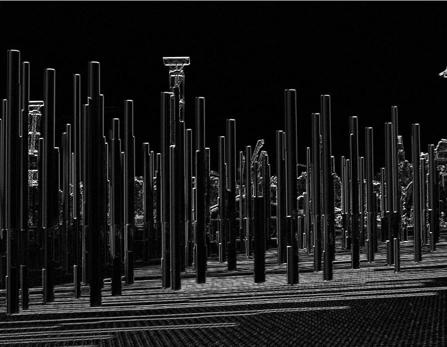

# Image Edge Detection

A Robinson inspired computer vision algorithm to detect edges in images.
Images are processed and each pixel replaced with likeliness of being an edge in greyscale value.

## Examples

Before:

After:

## License
Distributed under the ISC license.
